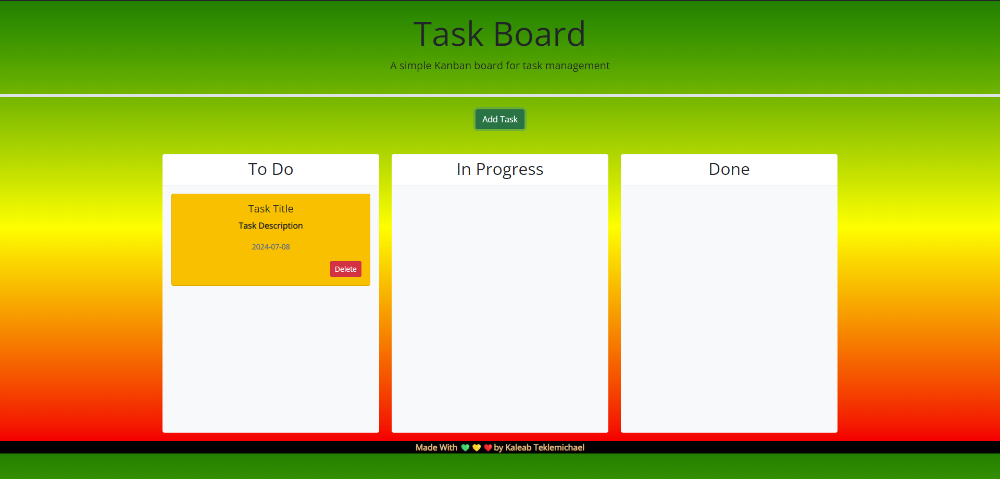
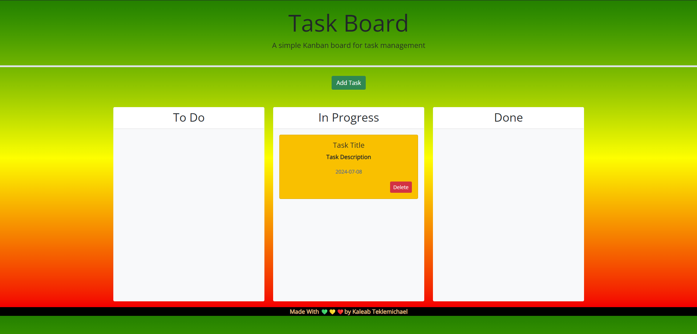
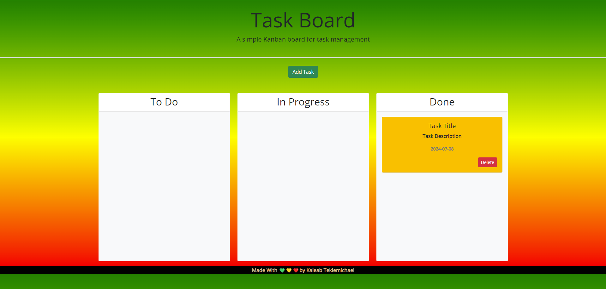

# Task Board

This is a task management website that organizes your tasks into three catagories depending on what stage you are in. The three catagories are To Do, In Progress, and Done.This task management website takes the tasks entered and saves it on the local storage. You are also able to drag and drop the tasks that are in the each column and each task is stored on the local storage for later retrieval with a unique task id.
Please Follow this link to access this Task Management Website - https://baelak.github.io/KT-M5-task-Board/

Enjoy

💚💛❤️

Kaleab Teklemichael